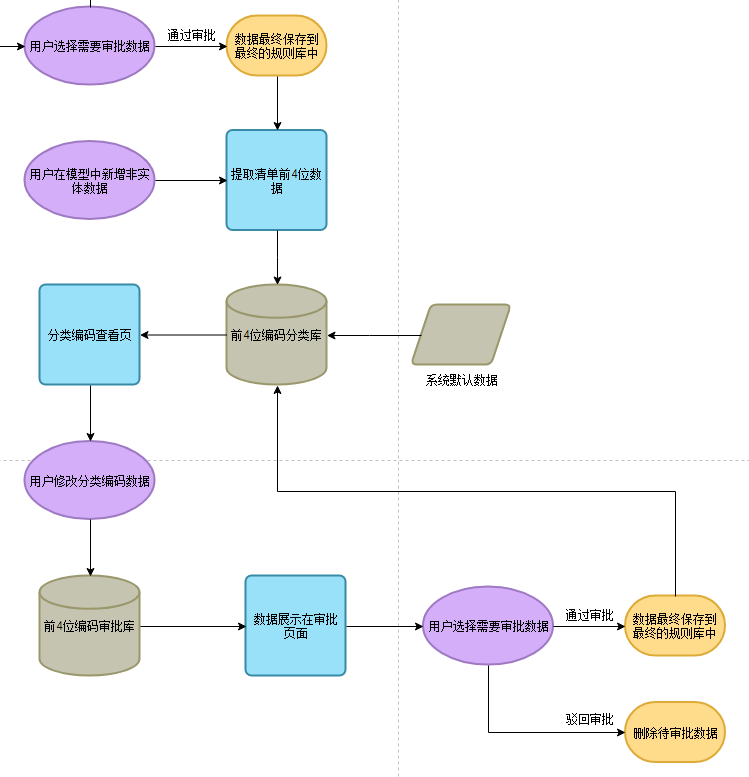
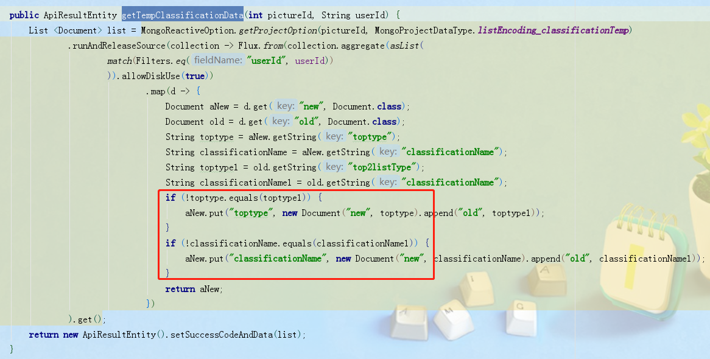
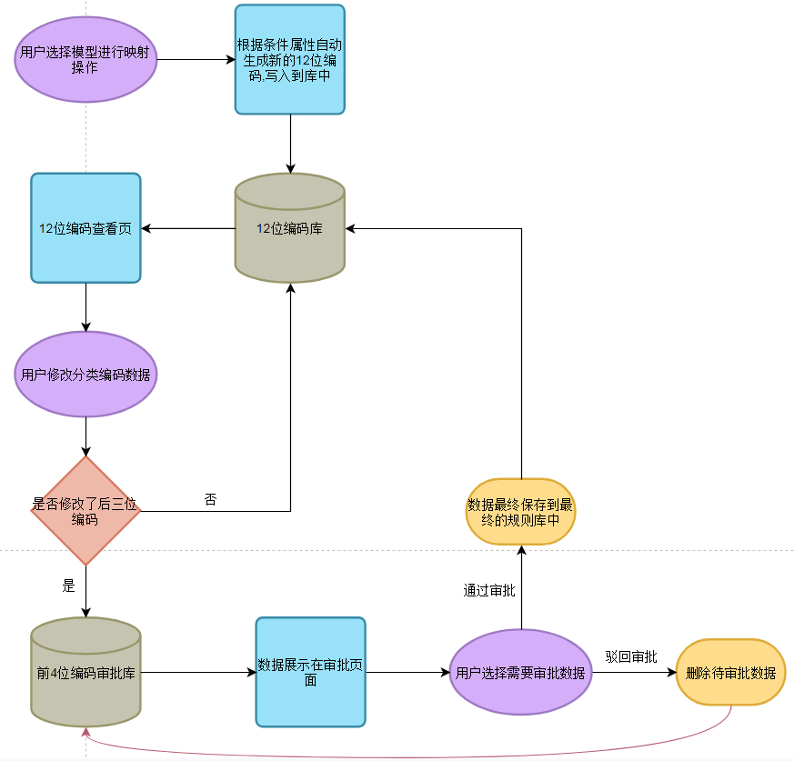
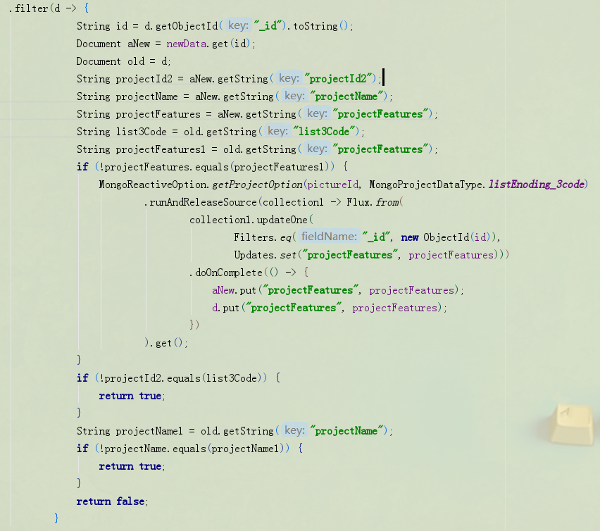
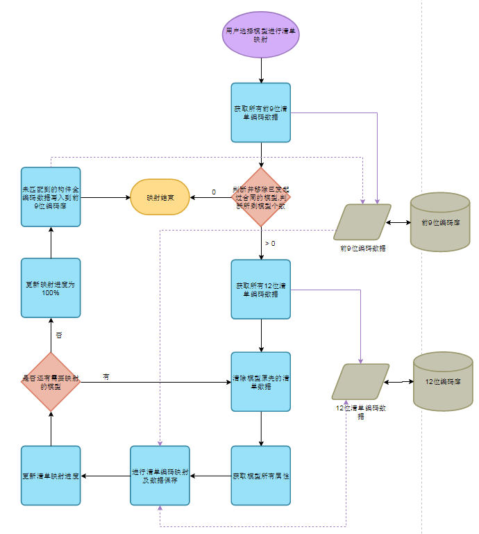
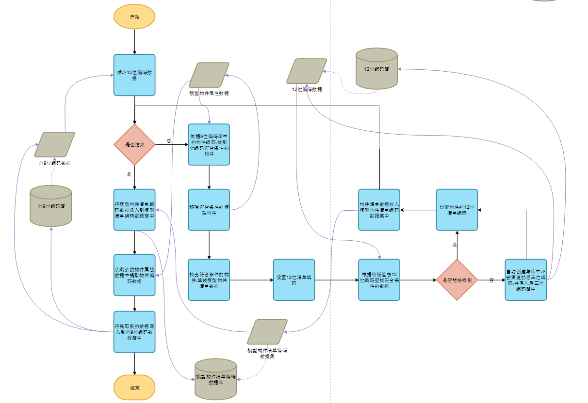
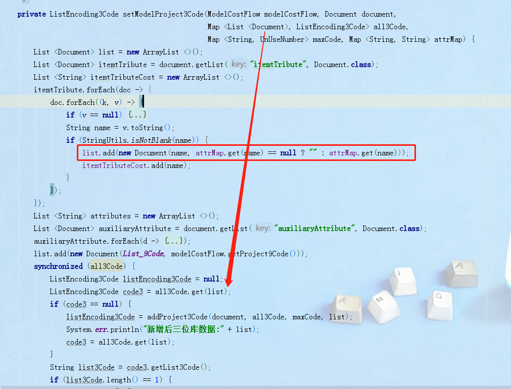

# 1. 造价模块
## 1.1. 相关开发人员
1. 造价模块总共有**清单编码规则库,模型清单编码映射,模型清单数据展示和发起合同,计量和支付流程**四个部分,每个部分由几个人共同开发.
> * 整个模块中所有前端数据展示,主要由方超群和郝林通开发;
> * 清单编码规则库包含了规则库导入和规则库维护,由王亚威,谭紫微,和袁长青共同开发;
> * 模型清单编码映射,主要实现依据清单编码的生成规则,实现模型构件与清单数据挂接,主要由袁长青开发;
> * 模型清单数据展示,主要包括了单个模型内清单数据展示及维护,清单文件下载和模型外多个模型清单数据展示,清单文件下载,主要由袁长青,谭紫薇开发;另外模型属性中展示清单数据,由赵鹏鹏完成;
> * 发起合同,计量和支付流程,是将模型的清单数据与泛微的流程整合,主要是由袁长青,谭紫薇和王正立开发;
2. 相关代码位置:
```java
com.Action.Mongo.ModelCostFlowAction    //模型清单编码映射及流程数据录入操作
com.Action.Mongo.ModelCostSortAction    //多个模型清单汇总数据操作
com.Action.Mongo.ModelLastThreeCostFlowAction  //清单12为编码相关操作
com.Action.Mongo.ListEncodingAction    //前9位清单编码规则库操作
com.Action.BimCostmAction    //模型内清单编码维护操作
com.Action.Mongo.EncodingMappyAction    //旧版的清单映射操作,已废弃

com.service.BimCostmService    //模型内清单编码维护操作
com.service.mongo.ListEncodingService     //前9位清单编码规则库操作
com.service.mongo.ModelCostFlowService    //模型清单编码映射及流程数据录入操作
com.service.mongo.ModelCostSortingService    //多个模型清单汇总数据操作
com.service.mongo.ModelCostSortTreeService    //多个模型清单汇总数据操作
com.service.mongo.ModelLastThreeCostFlowService    //清单12为编码相关操作
com.service.mongo.EncodingMappyService     //旧版的清单映射操作,已废弃
```

## 1.2. 造价模块数据库设计

## 1.3. 清单编码规则库
### 1.3.1. 前9位编码规则表维护
由用户到入Excel规则文档,我们与现有规则进行对比,生成审批数据,由用户自主选择需要的数据进行审批通过操作;
用户也可以在规则库查看页面进行修改,修改后也是要进行审批

这部分是亚威做的开发,如果需要了解具体技术实现,可以咨询亚威

### 1.3.2. 编码分类表维护
编码分类表是截取前9位编码的的前4位而得到的数据,用来后续对清单数据进行分类展示,
分类编码库也可以在数据查看页进行数据修改

> 提取清单编码前4位数据,保存分类编码数据代码位置:`com.service.mongo.ModelCostSortingService#insertClassificationInfoService`,具体细节可以找紫薇
> 用户修改分类编码数据保存: `com.service.mongo.ModelCostFlowService#saveTempClassificationData`,

> 代码中填了条件判断,同一个人修改同一条数据两次,将会保存最后一次的数据;
> 数据展示是需要标注出哪些数据发生改变,以及旧数据是什么 `com.service.mongo.ModelCostFlowService#getTempClassificationData`

> 驳回审批 `com.service.mongo.ModelCostFlowService#deleteTempClassificationData`
> 通过审批 `com.service.mongo.ModelCostFlowService#updateClassificationData`

### 1.3.3. 清单12位规则库
12位规则库维护逻辑:

想关代码位置:
> 页面查看:`com.service.mongo.ModelLastThreeCostFlowService#findLastThreeCostValues`
> 修改:`com.service.mongo.ModelLastThreeCostFlowService#saveTempChangeThreeCost`
注意下图中的代码:

当发现修改了项目特征,则直接对12位编码库中的数据进行修改,无需进行审批;当同时修改了项目特征和后三位编码,则对后三位编码进行审批,而项目直接替换成新修改的数据,进入审批
## 1.4. 模型清单编码映射
映射主逻辑:

代码位置:`com.service.mongo.ModelCostFlowService#repeatMapCode`
此处在操作映射之前是拿到了所有的数据,如果清单属性与构件属性的数据很大,就会占用很大的内存资源,后续可进行优化处理
具体的映射逻辑图:

具体代码位置:`com.service.mongo.ModelCostFlowService#dealListEncodeDoc`

此处获取后三位编码是用list对象作为key来作为key值,list的equals方法以重写如下:
~~~java
    public boolean equals(Object o) {
        if (o == this)
            return true;
        if (!(o instanceof List))
            return false;
        ListIterator<E> e1 = listIterator();
        ListIterator<?> e2 = ((List<?>) o).listIterator();
        while (e1.hasNext() && e2.hasNext()) {
            E o1 = e1.next();
            Object o2 = e2.next();
            if (!(o1==null ? o2==null : o1.equals(o2)))
                return false;
        }
        return !(e1.hasNext() || e2.hasNext());
    }
~~~
由此代码可以看出,list中的数据顺序不会参与equals判断,所以后三位的自动创建与构件属性的顺序无关,仅与属性值有关
## 1.5. 模型清单数据展示


