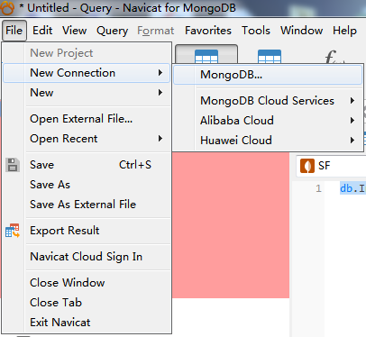
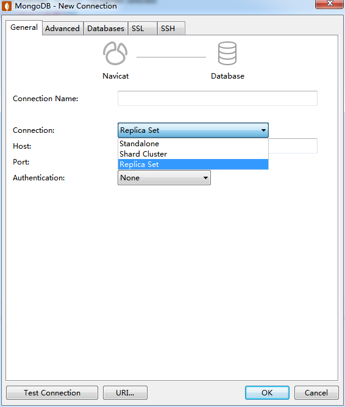
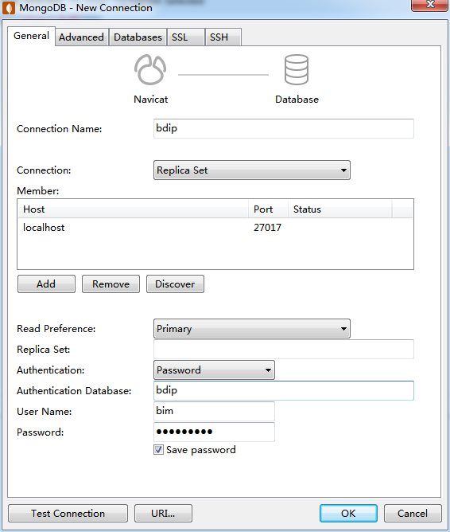
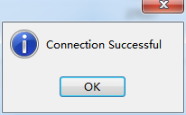
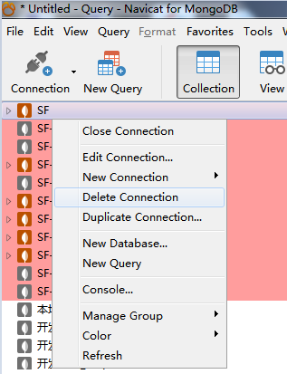
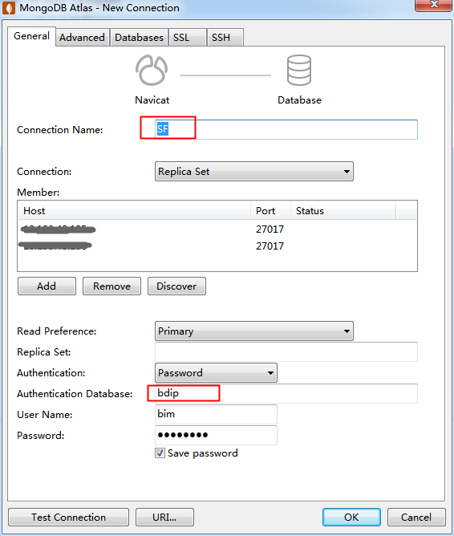

# 1. mongo连接配置说明

## 1.1. 使用控制台连接

```
mongodb:#[username:password@]host1[:port1][,host2[:port2],[,hostN[:portN]]][/[database]]

```
说明:
    **Mongodb:**#必填的前缀，标识当前字符串为便准链接格式
    **username:password@**  #可选项，给出用户名和密码后，在连接数据库服务器后，驱动都会尝试登陆这个数据库
    **hosturi**  #里唯一的必填项，数据库的连接地址,人如果需要连接副本集，需要制定多个主机地址
    **port**   #可选项，如果不填则默认为27017端口
    **/database**   #希望连接到的数据库名称，只要在设置username:password@后才会有效，如果不指定，则默认为admin数据库

### 1.1.1. 说明

**因为MongoDB是对库进行验证单,所以每次切换到其他的库,就要重新创建新的连接**

## 1.2. 使用Navicat工具连接

[navicat-for-mongodb传送门](http://www.navicat.com.cn/products/navicat-for-mongodb)

安装好软件之后
点击File -> New Connection -> MongoDB 

先选择连接类型 Replica Set

1.填写连接名称,
2.点击add添加地址与端口号,
3.选择验证类型为Password,
4.Database填写需要连接的库名称.
5填写名称和密码


点击Test Connection,弹出

然后点击OK,就成功的连接到了MongoDB数据库

### 1.2.1. 说明

**因为MongoDB是对库进行验证单,所以每次切换到其他的库,就要重新创建新的连接**
如果快速创建其他的库的连接,可以已有的连接右击,点击Duplicate Connection

修改其中的连接名称,并将Database修改为对应库的名称就行(其中的用户名和密码都一致)


# 2. MongoDB基本操作

## 2.1. 操作集合
```shell
show dbs; // 查看所有数据库

use bdip; //使用 bdip 数据库

show collections; // 查看当前数据库 所有集合（collections）

db.creatCollection("posts"); //创建集合

db.posts.renameCollection("staff"); //修改集合posts名为staff

db.staff.drop();//删除staff文档集合
```
## 2.1. 文档操作
```shell
db.createCollection("posts");//创建集合posts

// 在当前数据库下的posts文档下新增一条数据
db.posts.insert( 
 {
     title: "测试数据1",
     content: "测试数据内容1"
 }
 );
 
db.posts.find();

db.posts.find({"title":"测试数据1"});//查找出title="测试数据1"的数据

db.posts.count();//统计当前数据库下posts文档的所有数据条数

db.posts.remove({}); // 删除当前数据库下的posts文档的所有数据
```